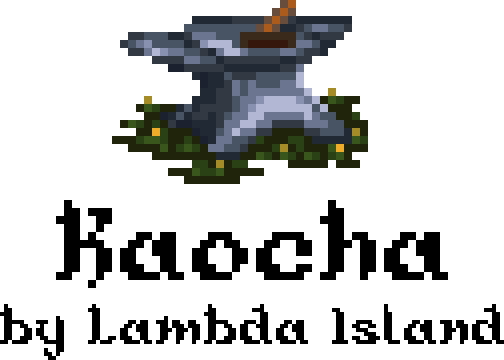

<p align="center"></p>

Full featured next generation test runner for Clojure.

Jump to [Quick start](#quick-start) | [Docs](#docs)

## Projects

<!-- projects -->
| Project | CI | Docs | Release | Coverage |
|---------|----|------|---------|----------|
| [kaocha](https://github.com/lambdaisland/kaocha) | [](https://circleci.com/gh/lambdaisland/kaocha) | [](https://cljdoc.org/d/lambdaisland/kaocha) | [](https://clojars.org/lambdaisland/kaocha) | [](https://codecov.io/gh/lambdaisland/kaocha) |
| [kaocha-cljs](https://github.com/lambdaisland/kaocha-cljs) | [](https://circleci.com/gh/lambdaisland/kaocha-cljs) | [](https://cljdoc.org/d/lambdaisland/kaocha-cljs) | [](https://clojars.org/lambdaisland/kaocha-cljs) | [](https://codecov.io/gh/lambdaisland/kaocha-cljs) |
| [kaocha-cucumber](https://github.com/lambdaisland/kaocha-cucumber) | [](https://circleci.com/gh/lambdaisland/kaocha-cucumber) | [](https://cljdoc.org/d/lambdaisland/kaocha-cucumber) | [](https://clojars.org/lambdaisland/kaocha-cucumber) | [](https://codecov.io/gh/lambdaisland/kaocha-cucumber) |
| [kaocha-junit-xml](https://github.com/lambdaisland/kaocha-junit-xml) | [](https://circleci.com/gh/lambdaisland/kaocha-junit-xml) | [](https://cljdoc.org/d/lambdaisland/kaocha-junit-xml) | [](https://clojars.org/lambdaisland/kaocha-junit-xml) | [](https://codecov.io/gh/lambdaisland/kaocha-junit-xml) |
| [kaocha-cloverage](https://github.com/lambdaisland/kaocha-cloverage) | [](https://circleci.com/gh/lambdaisland/kaocha-cloverage) | [](https://cljdoc.org/d/lambdaisland/kaocha-cloverage) | [](https://clojars.org/lambdaisland/kaocha-cloverage) | [](https://codecov.io/gh/lambdaisland/kaocha-cloverage) |
| [kaocha-boot](https://github.com/lambdaisland/kaocha-boot) | [](https://circleci.com/gh/lambdaisland/kaocha-boot) | [](https://cljdoc.org/d/lambdaisland/kaocha-boot) | [](https://clojars.org/lambdaisland/kaocha-boot) | [](https://codecov.io/gh/lambdaisland/kaocha-boot) |
| [deep-diff](https://github.com/lambdaisland/deep-diff) | [](https://circleci.com/gh/lambdaisland/deep-diff2) | [](https://cljdoc.org/d/lambdaisland/deep-diff) | [](https://clojars.org/lambdaisland/deep-diff) | [](https://codecov.io/gh/lambdaisland/deep-diff) |
<!-- /projects -->

## 考察 [kǎo chá]

- to inspect
- to observe and study
- on-the-spot investigation

See the [Line Dict entry](https://dict.naver.com/linedict/zhendict/dict.html#/cnen/entry/89b3f694bb3a4fd49e3241c6bd1cb79f) for an audio sample.


## Need help?

Are you

- reporting a bug? -> [File an issue](https://github.com/lambdaisland/kaocha/issues)
- looking for support? -> [Post to the forum](https://clojureverse.org/c/projects/kaocha)
- looking to contribute? -> Create a pull request or start by discussing your plans [on the forum](https://clojureverse.org/c/projects/kaocha)

There is also a [#kaocha](https://clojurians.slack.com/messages/CCY2V0U6A/convo/CCY2V0U6A-1559819261.002300/) channel on Clojurians Slack (sign up [here](http://clojurians.net/)), where users can help each other.

## Docs

<!-- docs-toc -->
- [1. Introduction](https://cljdoc.org/d/lambdaisland/kaocha/CURRENT/doc/1-introduction)
- [2. Installing](https://cljdoc.org/d/lambdaisland/kaocha/CURRENT/doc/2-installing)
- [3. Configuration](https://cljdoc.org/d/lambdaisland/kaocha/CURRENT/doc/3-configuration)
- [4. Running Kaocha CLI](https://cljdoc.org/d/lambdaisland/kaocha/CURRENT/doc/4-running-kaocha-cli)
- [5. Running Kaocha From the REPL](https://cljdoc.org/d/lambdaisland/kaocha/CURRENT/doc/5-running-kaocha-from-the-repl)
- [6. Focusing and Skipping](https://cljdoc.org/d/lambdaisland/kaocha/CURRENT/doc/6-focusing-and-skipping)
- [7. Watch mode](https://cljdoc.org/d/lambdaisland/kaocha/CURRENT/doc/7-watch-mode)
- [8. Plugins](https://cljdoc.org/d/lambdaisland/kaocha/CURRENT/doc/8-plugins)
- [9. Extending](https://cljdoc.org/d/lambdaisland/kaocha/CURRENT/doc/9-extending)
- [10. Hooks](https://cljdoc.org/d/lambdaisland/kaocha/CURRENT/doc/10-hooks)
- [`clojure.test` assertion extensions](https://cljdoc.org/d/lambdaisland/kaocha/CURRENT/doc/-clojure-test-assertion-extensions)
- [Capability check for org.clojure/tools.cli If a project's dependency](https://cljdoc.org/d/lambdaisland/kaocha/CURRENT/doc/capability-check-for-org-clojure-tools-cli-if-a-project-s-dependency)
- [CLI: `--fail-fast` option](https://cljdoc.org/d/lambdaisland/kaocha/CURRENT/doc/cli-fail-fast-option)
- [CLI: Print the Kaocha configuration](https://cljdoc.org/d/lambdaisland/kaocha/CURRENT/doc/cli-print-the-kaocha-configuration)
- [CLI: `--profile` option](https://cljdoc.org/d/lambdaisland/kaocha/CURRENT/doc/cli-profile-option)
- [CLI: `--reporter` option](https://cljdoc.org/d/lambdaisland/kaocha/CURRENT/doc/cli-reporter-option)
- [CLI: Selecting test suites](https://cljdoc.org/d/lambdaisland/kaocha/CURRENT/doc/cli-selecting-test-suites)
- [Configuration: Bindings](https://cljdoc.org/d/lambdaisland/kaocha/CURRENT/doc/configuration-bindings)
- [Focusing based on metadata](https://cljdoc.org/d/lambdaisland/kaocha/CURRENT/doc/focusing-based-on-metadata)
- [Focusing on specific tests](https://cljdoc.org/d/lambdaisland/kaocha/CURRENT/doc/focusing-on-specific-tests)
- [Skipping based on metadata](https://cljdoc.org/d/lambdaisland/kaocha/CURRENT/doc/skipping-based-on-metadata)
- [Skipping test based on ids](https://cljdoc.org/d/lambdaisland/kaocha/CURRENT/doc/skipping-test-based-on-ids)
- [Marking tests as pending](https://cljdoc.org/d/lambdaisland/kaocha/CURRENT/doc/marking-tests-as-pending)
- [Plugin: Capture output](https://cljdoc.org/d/lambdaisland/kaocha/CURRENT/doc/plugin-capture-output)
- [Plugin: Hooks](https://cljdoc.org/d/lambdaisland/kaocha/CURRENT/doc/plugin-hooks)
- [Plugin: Notifier (desktop notifications)](https://cljdoc.org/d/lambdaisland/kaocha/CURRENT/doc/plugin-notifier-desktop-notifications-)
- [Orchestra (spec instrumentation)](https://cljdoc.org/d/lambdaisland/kaocha/CURRENT/doc/orchestra-spec-instrumentation-)
- [Plugin: Clojure/Java Version filter](https://cljdoc.org/d/lambdaisland/kaocha/CURRENT/doc/plugin-clojure-java-version-filter)
- [Automatic spec test check generation](https://cljdoc.org/d/lambdaisland/kaocha/CURRENT/doc/automatic-spec-test-check-generation)
<!-- /docs-toc -->

## Features

Features include

- Filtering tests based on test names or metadata
- Watch mode: watch the file system for changes and re-run tests
- Pretty, pluggable reporting
- Randomize test order
- Detect when interrupted with ctrl-C and print report
- Fail fast mode: stop at first failure and print report
- Profiling (show slowest tests)
- Dynamic classpath handling
- Tests as data (get test config, test plan, or test results as EDN)
- Extensible test types (clojure.test, Midje, ...)
- Extensible through plugins
- Tool agnostic (Clojure CLI, Leiningen, ...)

## Quick start

This is no replacement for reading the docs, but if you're particularly
impatient to try it out, or if you already know Kaocha and need a quick
reference how to set up a new project, then this guide is for you.

### Clojure CLI (tools.deps)

Add Kaocha as a dependency, preferably under an alias.

``` clojure
;; deps.edn
{:deps { ,,, }
 :aliases
 {:test {:extra-deps {lambdaisland/kaocha {:mvn/version "1.66.1034"}}
         :main-opts ["-m" "kaocha.runner"]}}}
```

Add a binstub called `bin/kaocha`

```
mkdir -p bin
echo '#!/usr/bin/env sh' > bin/kaocha
echo 'clojure -M:test "$@"' >> bin/kaocha
chmod +x bin/kaocha
```

### Leiningen

Add a profile and alias

``` clojure
;; project.clj
(defproject my-proj "0.1.0"
  :dependencies [,,,]
  :profiles {:kaocha {:dependencies [[lambdaisland/kaocha "1.66.1034"]]}}
  :aliases {"kaocha" ["with-profile" "+kaocha" "run" "-m" "kaocha.runner"]})
```

Add a binstub called `bin/kaocha`

``` shell
mkdir -p bin
echo '#!/usr/bin/env sh' > bin/kaocha
echo 'lein kaocha "$@"' >> bin/kaocha
chmod +x bin/kaocha
```

### Boot

In your `build.boot` add the Kaocha dependency, and import the Kaocha task

``` clojure
;; build.boot
(set-env! :source-paths #{"src"}
          :dependencies '[[lambdaisland/kaocha-boot "..."]])

(require '[kaocha.boot-task :refer [kaocha]])
```

Add a binstub called `bin/kaocha`

``` bash
mkdir -p bin
echo '#!/usr/bin/env sh' > bin/kaocha
echo 'boot kaocha "$@"' >> bin/kaocha
chmod +x bin/kaocha
```

#### Clojure CLI (tools.deps) :exec-fn alternative

We also support using the Clojure CLI `:exec-fn`/`-X`. However, we recommend the
binstub approach above because it allows you to use traditional long and short
options.  If you nonetheless prefer `:exec-fn`/`-X`, you can set up `deps.edn`:

```clojure
;; deps.edn
{:deps { ,,, }
 :aliases 
 {:test {:extra-deps {lambdaisland/kaocha {:mvn/version "1.66.1034"}}
         :exec-fn kaocha.runner/exec-fn
         :exec-args {}}}}
```

And then Kaocha can be invoked this way: `clojure -X:test`

Generally speaking, we recommend using `tests.edn` for all of your configuration
rather than putting it in `exec-args` unless there's an alternative combination
of options you frequently run.

In that case, you can put configuration options `:exec-args` as though it were
`tests.edn`. Let's say you frequently use watch with `:fail-fast` and a subset
of tests skipped. You could save that configuration with an additional alias:
`clojure -X:watch-test` like so:


```clojure
;; deps.edn
{:deps { ,,, }
 :aliases 
 {:test {:extra-deps {lambdaisland/kaocha {:mvn/version "1.66.1034"}}
         :exec-fn kaocha.runner/exec-fn
         :exec-args {}}
 :watch-test {:extra-deps {lambdaisland/kaocha {:mvn/version "1.66.1034"}}
         :exec-fn kaocha.runner/exec-fn
         :exec-args {:watch? true
	 :skip-meta :slow
	 :fail-fast? true }}}}
```

If you wanted to turn off `fail-fast` temporarily, you could run `clojure
-X:watch-test :fail-fast? false`


### All tools

By default, Kaocha assumes that:
- source files are in the `src/` folder,
- test files are in the `test/` folder,
- all test namespaces _names_ end with `-test`
(e.g. `my-project.core-test`).
Also, the default test suite id is `:unit` (just `unit` on the command line).

If your tests don't seem to run (outcome is `0 tests, 0 assertions, 0 failures`)
you may need to write up your own configuration: add a `tests.edn` at the root
of the project to configure actual test and source paths, and optionally set a
reporter or load plugins (cf. Configuration in the
[documentation](https://cljdoc.org/d/lambdaisland/kaocha/)).


Example of a catch-all `tests.edn` config file (should run all
tests found in `src/` and `/test`, in any namespace).
``` clojure
#kaocha/v1
{:tests [{:id          :unit
          :test-paths  ["test" "src"]
          :ns-patterns [".*"]}]
          ;; :reporter kaocha.report.progress/report
          ;; :plugins [:kaocha.plugin/profiling :kaocha.plugin/notifier]
 }
```
Warning: this is not an optimal configuration. To avoid extra churn, you should
try and target only folders and namespaces that actually contain tests.

Run your tests

``` shell
bin/kaocha

# Watch for changes
bin/kaocha --watch

# Exit at first failure
bin/kaocha --fail-fast

# Only run the `unit` suite
bin/kaocha unit

# Only run a single test
bin/kaocha --focus my.app.foo-test/bar-test

# Use an alternative config file
bin/kaocha --config-file tests_ci.edn

# See all available options
bin/kaocha --test-help
```

## Third party projects

* [kaocha-noyoda](https://github.com/magnars/kaocha-noyoda) Don't speak like
  Yoda, write `(is (= actual expected))` instead of `(is (= expected actual))`

## Requirements

Kaocha requires Clojure 1.9 or later.

<!-- opencollective -->

&nbsp;


&nbsp;

## Support Lambda Island Open Source

kaocha is part of a growing collection of quality Clojure libraries and
tools released on the Lambda Island label. If you are using this project
commercially then you are expected to pay it forward by
[becoming a backer on Open Collective](http://opencollective.com/lambda-island#section-contribute),
so that we may continue to enjoy a thriving Clojure ecosystem.

&nbsp;

&nbsp;

<!-- /opencollective -->

<!-- contributing -->
## Contributing

Everyone has a right to submit patches to kaocha, and thus become a contributor.

Contributors MUST

- adhere to the [LambdaIsland Clojure Style Guide](https://nextjournal.com/lambdaisland/clojure-style-guide)
- write patches that solve a problem. Start by stating the problem, then supply a minimal solution. `*`
- agree to license their contributions as EPL 1.0.
- not break the contract with downstream consumers. `**`
- not break the tests.

Contributors SHOULD

- update the CHANGELOG and README.
- add tests for new functionality.

If you submit a pull request that adheres to these rules, then it will almost
certainly be merged immediately. However some things may require more
consideration. If you add new dependencies, or significantly increase the API
surface, then we need to decide if these changes are in line with the project's
goals. In this case you can start by [writing a pitch](https://nextjournal.com/lambdaisland/pitch-template),
and collecting feedback on it.

`*` This goes for features too, a feature needs to solve a problem. State the problem it solves, then supply a minimal solution.

`**` As long as this project has not seen a public release (i.e. is not on Clojars)
we may still consider making breaking changes, if there is consensus that the
changes are justified.
<!-- /contributing -->

<!-- license -->
## License

Copyright &copy; 2018-2021 Arne Brasseur and contributors

Available under the terms of the Eclipse Public License 1.0, see LICENSE.txt
<!-- /license -->
