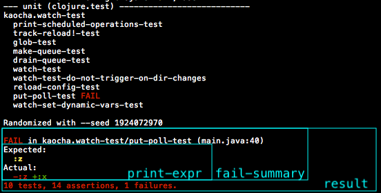

# 9. Extending

Kaocha is designed to be extensible and customizable, so that it can adapt to
the needs of different projects, and so that it can act as a common base layer
upon which innovative or advanced testing features can be delivered.

## Concepts

The key to understanding Kaocha is understanding the three steps that Kaocha
goes through to perform a test run, and the three associated data structures.

### Run structure

A Kaocha test run consists of three part

- Configure
- Load
- Run

In the configure step the configuration file is loaded, normalized, and any
command line options merged in. Plugins are loaded at this staged, and given a
chance to update the configuration. The result is a Kaocha configuration (spec:
`:kaocha/config`)

After this each test suite loads. This means loading the test namespaces and
finding out which tests are in them. The loading specifics are delegated to the
test suite type. After the load step the Kaocha configuration has transformed
into a test plan (spec: `:kaocha/test-plan`), containing a nested collection of
"testables", providing a detailed overview of which tests will be run.

Finally the test-plan gets run, which means recursively executing the collection
of testables. Each testable gets updated with information about the test run:
whether it failed/passed/errored, captured output or exceptions, etc. After this
step the test-plan has transformed into a test result. (spec: `:kaocha/result`)

It's a good idea to keep the [specs](/src/kaocha/specs.clj) handy as a
reference.

### testable

A testable is a map containing the testable's type, id, type specific
information, and nested testables.

There are three versions of testables. In the configuration there are only
top-level testables, also called test suites, stored under `:kaocha/tests`.

``` clojure
{:kaocha/tests [{:kaocha.testable/type :kaocha.type/clojure.test
                 :kaocha.testable/id :unit
                 :kaocha/source-paths ["src"]
                 :kaocha/test-paths ["test"]}]}
```

Loading these tests is done with the `kaocha.testable/-load` multimethod, which
dispatches on the testable type.

After the load step these have become test-plan testables, with lots of extra
info, including nested test-plan testables.

``` clojure
{:kaocha.test-plan/tests [{:kaocha.testable/type :kaocha.type/clojure.test
                           :kaocha.testable/id :unit
                           :kaocha/source-paths ["src"]
                           :kaocha/test-paths ["test"]
                           :kaocha.testable/meta {}
                           :kaocha.test-plan/tests [{:kaocha.testable/type :kaocha.type/ns
                                                     :kaocha.testable/id :kaocha.runner-test
                                                     ,,,
                                                     :kaocha.test-plan/tests [{:kaocha.testable/type :kaocha.testable/var
                                                                               :kaocha.testable/id :kaocha.runner-test/main-test
                                                                               ,,,}]}]}]}
```

Running these tests is again type specific, each type has an implementation of
`kaocha.testable/-run`, which recursively calls `kaocha.testable/run-tests`,
which collects the results into the test result data structure.

``` clojure
{:kaocha.result/tests [{:kaocha.testable/type :kaocha.type/clojure.test
                        :kaocha.testable/id :unit
                        :kaocha/source-paths ["src"]
                        :kaocha/test-paths ["test"]
                        :kaocha.testable/meta {}
                        :kaocha.result/tests [{:kaocha.testable/type :kaocha.type/ns
                                               :kaocha.testable/id :kaocha.runner-test
                                               ,,,
                                               :kaocha.result/tests [{:kaocha.testable/type :kaocha.testable/var
                                                                      :kaocha.testable/id :kaocha.runner-test/main-test
                                                                      :kaocha.result/count 1
                                                                      :kaocha.result/pass 1
                                                                      :kaocha.result/fail 0
                                                                      :kaocha.result/error 0
                                                                      ,,,}]}]}]}
```

## Extension types

### Plugins

A plugin consists of functions that get run when certain "hooks" within Kaocha
fire, bundled in a map from keyword to function.

To write a Kaocha plugin you implement the `kaocha.plugin/-register`
multimethod. This allows the plugin to add itself to the "plugin chain", a
vector of plugin maps.

``` clojure
(ns my.kaocha.plugin
  (:require [kaocha.plugin :as p]))

(defmethod p/-register :my.kaocha/plugin [_name plugins]
  (conj plugins
        {:kaocha.hooks/config
         (fn [config]
           (assoc config ::setting :foo))

         :kaocha.hooks/pre-run
         (fn [test-plan]
           (println "run is starting!")
           test-plan)}))
```

Plugin names must be namespaced keywords. If your plugin is called
`:foo.bar/baz` then it must be implemented in the namespace `foo.bar` or
`foo.bar.baz`. This will allow Kaocha to automatically load the plugin before
calling it.

To take the boilerplate out of writing plugins you are encouraged to use the
`defplugin` macro.

These are all the hooks a plugin can implement. Note that each must return its
first argument (possibly updated).

The [hooks chapter](10_hooks.md) has more information about most of these hooks.

``` clojure
(ns my.kaocha.plugin
  (:require [kaocha.plugin :as p]))

(p/defplugin my.kaocha/plugin
  ;; Install extra CLI options and flags.
  (cli-options [opts]
    (conj opts [nil "--my-plugin-option" "Does something plugin specific."]))

  ;; Alter the configuration. Useful for setting default values and processing cli-options.
  (config [config]
    (if (:my-plugin-option (:kaocha/cli-options config))
      (assoc config ::some-flag true)
      config))

  ;; Runs before the load step
  (pre-load [config]
    config)

  ;; Runs after the load step
  (post-load [test-plan]
    test-plan)

  ;; Runs before the run step
  (pre-run [test-plan]
    test-plan)

  ;; Runs before each individual test gets loaded, gets passed the testable
  (pre-load-test [testable config]
    testable)

  ;; Runs after each individual test has been loaded, gets passed the testable
  (post-load-test [testable config]
    testable)

  ;; Runs before each individual test
  (pre-test [test test-plan]
    test)

  ;; Runs after each individual test
  (post-test [test test-plan]
    test)

  ;; Runs after the run step
  (post-run [result]
    result)

  ;; Allows "wrapping" the run function
  (wrap-run [run test-plan]
    run)

  ;; Runs before the reporter
  (pre-report [event]
    event)

  ;; Runs right before kaocha.runner calls kaocha.api/run. This is for plugins
  ;; that optionally do something else besides running tests, like printing
  ;; informational messages and then exiting. For this throw+ a
  ;; {:kaocha/early-exit}.
  (main [config]
    (if (:do-other-thing (:kaocha/cli-options config))
      (do
        (... do other thing ...)
        (throw+ {:kaocha/early-exit 0}))
      config))

  ;; Gets called after the run is finished and the summary has been printed/reported.
  ;; Gets passed the test result map (test plan with results).
  (post-summary [test-result]
    ))
```

### Tips for developing plugins

Start with the boilerplate, i.e. a namespace + empty defplugin declaration.

``` clojure
(ns my.kaocha.plugin
  (:require [kaocha.plugin :refer [defplugin]]))

(defplugin my.kaocha/plugin
  ,,,)
```

From there you could already add it to `tests.edn` and e.g. start in `--watch`
and start iterating, but that's a pretty coarse workflow. For more fine-grained
work you can use `kaocha.repl`, in particular `kaocha.repl/config` and
`kaocha.repl/test-plan` (we should probably also add a `kaocha.repl/result` so
you can inspect the final result data).

So say you have a `pre-load` hook, and your plugin is enabled in `tests.edn`,
then you can call `(kaocha.repl/test-plan)` and see the effects of your plugin.

`defplugin` will actually define several vars, plus the final `defmethod` which
registers the plugin. So you can test your hooks in isolation.

``` clojure
(defplugin my.kaocha/plugin
  "Docstring"
  (cli-options [opts] opts)
  (config [config] config)
  (pre-load [config] config))

;; This defines
(defn plugin-cli-options-hook [opts] opts)
(defn plugin-config-hook [config] config)
(defn plugin-pre-load-hook [config] config)

(def plugin-hooks
  {:kaocha.plugin/id :my.kaocha/plugin
   :kaocha.plugin/description "Docstring"
   :kaocha.hooks/cli-options plugin-cli-options-hook
   :kaocha.hooks/config plugin-config-hook
   :kaocha.hooks/pre-load plugin-pre-load-hook})

(defmethod kaocha.plugin/-register :my.kaocha/plugin [chain]
  (conj chain plugin-hooks))
```

So this is great for unit tests (test the hooks directly), and should be helpful
when developing from the REPL as well.

``` clojure
(my.kaocha.plugin/plugin-config-hook (kaocha.repl/config))
;; => ???
```
You may wonder why all this boilerplate, e.g. why does the `-register` method
have to call `conj`, on the plugin chain, instead of just returning the map with
hooks? The reason is this allows for plugins to do more complex things, like
injecting multiple plugins at once, adding a plugin before or after an other
one, or wrapping functions of other plugins.

Now of course the question is: which hooks to use and what to do with them.
Generally your hooks will fall into two categories, either you're just using a
hook to cause some side effect at a certain point in the execution, or you're
manipulating Kaocha's data structures to change its behavior.

Kaocha is very data driven, so the idea is that e.g. by changing the config or
test-plan you can change its behavior. For instance you can implement special
test filtering with a `pre-test` hook that does `(assoc testable
:kaocha.testable/skip true)` when a certain condition is met. Here you'll have
to poke around the source a bit, look for the place where you would normally
hack in your change, and then hope that there's a hook there and affordances to
cause the right behavior.

Final a general tip/best practice: if your plugin is in any way configurable,
then it should use the `cli-options` and `config` hooks, in such a way that
options specified on the CLI override those set in the config. The `cli-options`
hooks defines your command line flags, then in the `config` hooks you can
inspect `:kaocha/cli-options` in the config to find the flags used, and use them
to update the config, or provide a default. Any following hooks then look at the
config for the necessary settings (and so not directly at
`:kaocha/cli-options`). You can look at the built-in plugins, most of them use
this pattern.

This is important because this way when a user uses `--print-config` they see
those default values added by plugins, which they can copy to `tests.edn` and
tweak. (you should use namespaced keywords based on the name of your plugin.)

You should also check out `kaocha.test-util/with-test-ctx`, this is useful to
isolate unit tests from Kaocha itself.

### Test types

Kaocha is designed to be a universal tool, able to run any type of test suite
your project chooses to use. To make this possible it provides a way to
implement custom test suite types.

In the test configuration every suite has a type.

``` clojure
{:kaocha/tests [{:kaocha.testable/type :kaocha.type/clojure.test
                 :kaocha.testable/id   :unit}]}
```

When Kaocha encounters this test suite it will first try to load the type, by
requiring either the `kaocha.type` or `kaocha.type.clojure.test` namespace.

It will then validate the suite configuration using the
`:kaocha.type/clojure.test` spec, so a custom test suite implementation must
register a Clojure spec with the same name as the suite type.

Finally a test suite implements two multimethods, one that handles Kaocha's load
stage, and one that handles the run stage.

Here's a skeleton example of a test suite.

``` clojure
(ns kaocha.type.clojure.test
  (:require [clojure.spec.alpha :as s]
            [kaocha.testable :as testable]
            [kaocha.load :as load]
            [clojure.test :as t]))

(defmethod testable/-load :kaocha.type/clojure.test [testable]
  (assoc :kaocha.testable test-plan/tests (load-tests ...)))

(defmethod testable/-run :kaocha.type/clojure.test [testable test-plan]
  (t/do-report {:type :begin-test-suite})
  (let [results (testable/run-testables (:kaocha.test-plan/tests testable) test-plan)
        testable (-> testable
                     (dissoc :kaocha.test-plan/tests)
                     (assoc :kaocha.result/tests results))]
    (t/do-report {:type :end-test-suite
                  :kaocha/testable testable})
    testable))

(s/def :kaocha.type/clojure.test (s/keys :req [:kaocha/source-paths
                                               :kaocha/test-paths
                                               :kaocha/ns-patterns]))


(hierarchy/derive! :kaocha.type/clojure.test :kaocha.testable.type/suite)
```

### Tips for developing test types

Start by thinking about the hierarchy of your test types. You typically have a
top level "test suite" type, an intermediate "group" type, and the actual
individual tests, called the "leaf" type. You can think of suite/group/leaf
corresponding to directory/file/test, although it doesn't have to be that way.

For instance for clojure.test one or more directories for a suite, this suite
consists of namespaces, and each namespace contains test vars, so the hierarchy
is `:kaocha.type/clojure.test` > `:kaocha.type/ns` > `:kaocha.type/var`.

For Cucumber tests the hierarchy is `:kaocha.type/cucumber` >
`:kaocha.cucumber-feature` > `:kaocha.type/cucumber-scenario`.

You could have more or fewer levels. The top one is always known as the suite,
the bottom one as the leaf, the intermediate ones as groups.

For each test type you implement `kaocha.testable/-run`, and for the suite and
groups you implement `kaocha.testable/-load`. Then you use
`kaocha.testable/load-testables` / `kaocha.testable/run-testables` to perform
the recursion.

Use `kaocha.hierarchy/derive!` to mark your test types as suite/group/leaf.

```
(hierarchy/derive! :kaocha.type/clojure.test :kaocha.testable.type/suite)
(hierarchy/derive! :kaocha.type/ns :kaocha.testable.type/group)
(hierarchy/derive! :kaocha.type/var :kaocha.testable.type/leaf)
```

When implementing `-load` your job is to transform a configuration testable into
a test-plan testable, so you should `dissoc :kaocha/tests` and `assoc
:kaocha.test-plan/tests`.

`-load` is responsible for adding the test directories to the classpath (if this
applies for your test type). The helpers in `kaocha.load` will come in handy for
this.

If an error occurs while loading files then signal that by adding the
`:kaocha.testable/load-error` to the testable, with as value the caught
exception. You'll deal with signaling the error to the user during the `-run`
step.

The `-run` implementation generally starts by calling `clojure.test/do-report`
with a "begin" event, then it runs either the contained
`:kaocha.test-plan/tests` (for a suite/group), or runs the actual test, and then
calls `clojure.test/do-report` agin with an `:end` event.

The return value from `-run` is a `:kaocha.result/testable`, which is like a
`:kaocha.test-plan/testable`, but has (for a suite/group test)
`:kaocha.result/tests` rather than `:kaocha.test-plan/tests`, or has (for a leaf
test) result stats (count, error, fail, pass, pending) added.

To gather result stats you can use `kaocha.type/with-report-counters` /
`kaocha.type/report-count`.

The `-run` method for a leaf test should also take care of wrapping the core
test logic in any wrapping functions provided by `:kaocha.testable/wrap` on the
testable. This is important for output capturing to work correctly.

You should check that when your test fails, you get the right file and line
number in the output. Kaocha tries to detect this from the stacktrace, but that
doesn't always work. (see the `kaocha.monkey-patch` namespace). Alternatively
bind `kaocha.testable/*test-location*` to a map with `:file` and `:line`.

Before invoking the actual test logic, check for `:kaocha.testable/load-error`,
and if it's there then signal a test error and finish. You can do this with the
`kaocha.testable/handle-load-error` helper.

During the recursive invocations of `-run` `clojure.test` style events are
emitted by calling `clojure.test/do-report`. Rather than reusing pre-existing
generic event types you should come up with event types that are specific to
your test type, then use `kaocha.hierarchy/derive!` to attach semantics to them.

This is an example of event types, and the keywords they derive from.

``` clojure
:foo-test/begin-suite   :kaocha/begin-suite
:foo-test/begin-ns      :kaocha/begin-group

:foo-test/begin-test    :kaocha/begin-test
:foo-test/assert-failed :kaocha/fail-type
:foo-test/precondition-failed :kaocha/fail-type
:foo-test/end-test      :kaocha/end-test

:foo-test/begin-test    :kaocha/begin-test
:pass                   :kaocha/known-key
:foo-test/end-test      :kaocha/end-test

:foo-test/end-ns        :kaocha/end-group
:foo-test/end-suite     :kaocha/end-suite
```

Some notable parent types to inherit from:

- `:kaocha/known-key` all events we emit should eventually inherit from
  known-key. Any event we receive that is not a known-key will be propagated to
  the original `clojure.test/report` multimethod, for compatibility with
  assertion libraries that emit their own custom events and extend the
  multimethod to handle them.

- `:kaocha/fail-type` anything that fails the test should inherit from
  `fail-type`. Reporters that don't know about specific failure types can still
  use this to do some reporting of failures, print captured output, etc.

- `:kaocha/deferred` events that inherit from `deferred` are saved up during the
  test run, and will be sent to `clojure.test/report` during the summary step.
  This is how we make sure that the details of test failures are only printed
  all the way at the end during the `:summary` step, rather than immediately as
  they happen.

In general we try to use properly namespaced event types, but because Kaocha is
built on top of clojure.test (for better or for worse), we still use some of the
non-namespaced names used by clojure.test like `:pass`, `:fail`, `:error`. The
main reason is to keep (some) compatibility with reporters written for
`clojure.test` that are not Kaocha-aware. However there's no really good way to
do this, either we limit ourselves to the scope of `clojure.test`'s reporting
(which we don't want to do), or we go for a more semantically rich set of
events, but cause pre-existing reporters to misbehave.

We are well on the path to the latter, and so we will likely drop more of these
non-namespaced ones in favor of kaocha-specific ones, and drop support for
legacy reporters alltogether.

### Reporters

Reporters generate the test runners output. They are in their nature side-effectful, printing to stdout in response to events.

Before creating your own reporters, consider whether the same thing could be accomplished with plugins. They provide a more functional and composable interface, and should be preferred.

A reporter is a function which takes a single map as argument, with the map having a `:type` key. Kaocha uses the same types as `clojure.test`, but adds `:begin-test-suite` and `:end-test-suite`.

Kaocha contains fine-grained reporters, which you can combine, or mix with your own to get the desired output. A reporter can be either a function, or a sequence of reporters, which will all be called in turn. For instance, the default Kaocha reporter is defined as such:

``` clojure
(ns kaocha.report)

(def dots
  "Reporter that prints progress as a sequence of dots and letters."
  [dots* result])
```

The `result` reporter is a special one included in all default reporters that
takes care of the final results.

Reporters intended for use with `clojure.test` will typically call `clojure.test/inc-report-counters` to keep track of stats. Reporters intended for use with Kaocha should not do this. Kaocha will always inject the `kaocha.report.history/track` reporter which takes care of that.


Built in reporters include

- `kaocha.report/dots`
- `kaocha.report/documentation`
- `kaocha.report.progress/report`


#### Handling custom assertions ####

A common use case for extending or replacing reporters is to support custom assertion functions which emit their own `:type` of `clojure.test` events.

``` clojure
(clojure.test/do-report {:type ::my-assertion, :message ..., :expected ..., :actual ...})
```

For this use case you might not have to implement a custom reporter at all.

First make Kaocha aware of your new event type. This will prevent it from being foward to the original `clojure.test/report`, which by default just prints the map to stdout.

``` clojure
(kaocha.hierarchy/derive! ::my-assertion :kaocha/known-key)
```

If your event would cause a test to fail, then also mark it as a `:kaocha/fail-type`


``` clojure
(kaocha.hierarchy/derive! ::my-assertion :kaocha/fail-type)
```

This way Kaocha's built-in reporters will know that this event indicates a
failure, and correctly report it in the test results. It will also cause a
default failure message to be rendered based on the `:message`, `:expected`, and
`:actual` keys.

If you want to provide custom output then add an implementation of the
`kaocha.report/fail-summary` multimethod.

``` clojure
(defmulti kaocha.report/fail-summary ::my-assertion [m]
  (println ...)
  )
```

For a full example have a look at Kaocha's built-in [matcher combinator support](https://github.com/lambdaisland/kaocha/blob/ca2d71dbb1e259041fb5314a286d22416ce77555/src/kaocha/matcher_combinators.clj).


#### Overriding the default `result` output ####


if you want results to be reported differently, you can also customize the
default output at several levels:
* Replace `result` with your own for full control over the final results.
* you just want to customize the output of failures, override `fail-summary`,
    which `result` uses.
* If you want to just customize the part of the failure message that shows both
    the expected and actual, override `print-expr`, which `fail-summary` in turn
    uses.

Here's a typical failing message and the method responsible for each part:


We'll start with `result`. The main summary is implemented by the `result`
method for `:summary`:

```clojure
(defmethod result :summary [m]
   (println ...)
 )
```

Create a similar method in your project and then combine it with the
desired default reporter in your `tests.edn`:

```edn

 :kaocha/reporter                    [kaocha.report/dots* my.app.kaocha/result]

```

Note that you don't want to use `kaocha.report/dots` reporter here, as that will
use the default `fail-summary` and you'll end up with both your summary and the
default one.


If you like the general output of `result` but just want the failures to look
differenty, you can merely override `fail-summary` with your own implementation:

```clojure
(defmethod fail-summary :kaocha/fail-type [{:keys [testing-contexts testing-vars] :as m}]
  (println ...)
)
```

Finally, you can also override the default `print-expression` if all you want
is to override the part of `fail-summary` that prints the expected and actual
expressions.

For example, this alternate implementation shows the expected and actual input
without using `deepdiff`:

``` clojure
(defmethod kaocha.report/print-expr '= [m]
  (println "expected:" (pr-str (:expected m)))
  (println "  actual:" (pr-str (:actual m))))
```


